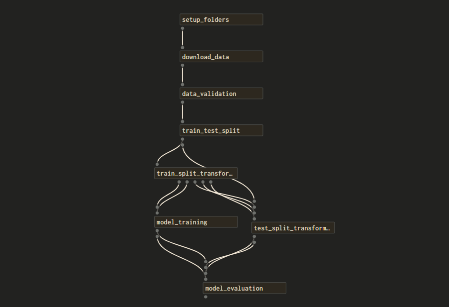

# MLOps with Dagster

## Introduction

An End-to-End MLOps Pipeline written in [Dagster](https://dagster.io/), a data orchestration platform. The pipeline
downloades home prices from [makaan.com](https://www.makaan.com) and performs the steps descibed in detail below.

## DAG

## Steps

### `setup_folders`

* Create folder `data`, if it doesn't already exist, to save the incoming data as well as the models and preprocessors
  in sub-folders `csv`, `models` and `preprocessors`.

### `download_data`

* Downloads the data
  from [makaan.com](https://www.makaan.com/kolkata-residential-property/buy-property-in-kolkata-city?page=1) specific to
  Kolkata, India.
* The data is downloaded using `requests` and parsed using `BeautifulSoup` with `lxml`.

### `data_validation`

* The data download in the previous step is validated using `pandas_schema` package.
* Validation includes checking data types, checking for null values and checking for valid entries.
* Clean data is separated, and passed through.
* The data is saved as a `.csv` file under `./data/csv`.

### `train_test_split`

* The data is split into a `train` set and a `test` split using `sklearn.model_selection.train_test_split`.

### `train_split_transformation`

* Transforms the train split by using -
    * Converted `Price` to lacs using `Unit` column.
    * `sklearn.preprocessing.LabelEncoder` on `Status`.
    * `sklearn.preprocessing.LabelEncoder` on `Age`.
    * `sklearn.preprocessing.StandardScaler` on the features.
* Passes through the `targets`, `features`, `preprocessors` and `scalers`.
* Saves `preprocessors` and `scalers` to `./data/preprocessors`.

### `test_split_tranformation`

* Applies the same transformations on the test split.
* Passes through `targets` and `features`.

### `model_training`

* Uses `sklearn.linear_model.ElasticNet` as the estimator,
* Uses`sklearn.model_selection.GridSearchCV` for hyperparameter tuning.
* Best model and it's set of parameters are passed through.

### `model_evaluation`

* Saves the model to `./data/models`.
* Saves model metrics to `./data/model_history.csv`.
* Future Ideas - 
  * To add functionality that would delete models/preprocessors older than some pre-defined period of time.
  * To select the best model from the available models.